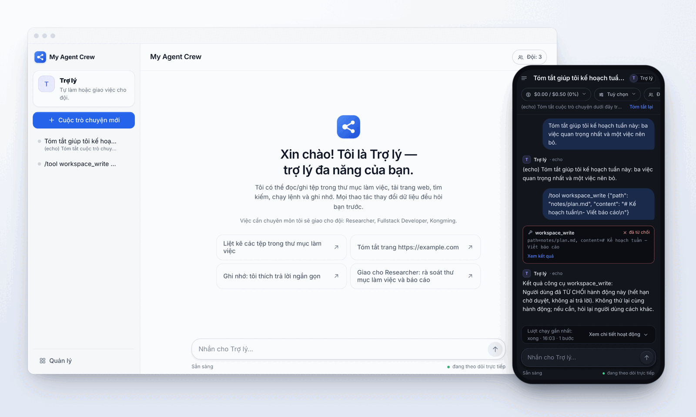

# my-agent-crew

A crew of agents running locally, with a friendly web UI and a single place to chat. Agents read/write files
in the working directory, run shell, fetch web pages, search, read images and PDFs, remember long term —
and **ask you first** before every operation that changes data, except the commands you have said are familiar.

You only talk to one master agent; it does the small work itself and delegates the big work to the right person
in the crew. Running work shows as a step-by-step timeline, so you always see what the agent is doing.

This is a lean rewrite of [my-crew](https://github.com/phuc-nt/my-crew): drops the router and the DAG,
keeps agents + tools + skills + memory, and puts the web UI up front.



## Run

```bash
uv sync
OPENROUTER_API_KEY=... uv run python -m my_agent_crew
# open http://127.0.0.1:8765
```

No key? Try it with the echo provider (no real model calls):

```bash
MY_AGENT_ROUTES=fake:echo uv run python -m my_agent_crew
```

In echo mode, type `/tool <name> {json}` to call a tool directly, for example
`/tool workspace_list {"path":"."}`.

## Configuration

Secrets are read **only** from environment variables; `config.yaml` holds only non-sensitive keys.

| Environment variable | Meaning | Default |
|---|---|---|
| `MY_AGENT_HOME` | data directory (db, workspace/, skills/, config.yaml) | `~/.my-agent-crew` |
| `MY_AGENT_ROUTES` | route chain of `provider:model`, comma-separated, tried in order | `openrouter:deepseek/deepseek-v4-flash` |
| `MY_AGENT_COST_CAP_USD` | default budget per conversation (0 = unlimited) | `0.5` |
| `MY_AGENT_MAX_STEPS` | maximum number of model calls in one turn | `12` |
| `MY_AGENT_AUTONOMOUS` | `1` to let write/mutating tools run without approval | off |
| `MY_AGENT_APPROVAL_TTL_SECONDS` | an approval request nobody answers within this window is auto-denied and the turn continues | `600` |
| `MY_AGENT_TIMEZONE` | your timezone (IANA name, e.g. `Asia/Ho_Chi_Minh`) for schedules, "today" in the prompt and statistics; the DB still stores UTC | machine timezone |
| `MY_AGENT_ALLOWED_HOSTS` | host names (besides `localhost` and IPs) allowed to call the API, comma-separated — e.g. a Tailscale MagicDNS name | empty |
| `OLLAMA_BASE_URL` | where local ollama listens; no key needed, so this provider is always available | `http://127.0.0.1:11434/v1` |
| `OPENROUTER_API_KEY` | enables the OpenRouter provider | — |
| `TAVILY_API_KEY` / `BRAVE_API_KEY` | paid search sources; if unset, `web_search` still runs via DuckDuckGo | — |
| `FIRECRAWL_BASE_URL` | firecrawl host for search and for reading pages as markdown | — |
| `FIRECRAWL_API_KEY` | only needed with firecrawl cloud | — |
| the name given by `telegram.token_env` (e.g. `TELEGRAM_BOT_TOKEN`) | the master's Telegram bot token; missing means the channel is off | — |

`config.yaml` in `MY_AGENT_HOME` accepts exactly these keys: `routes`, `vision_routes`,
`cost_cap_usd`, `max_steps`, `language`, `timezone`, `autonomous_default`,
`approval_ttl_seconds`, `tool_output_chars`, `shell_ask_patterns`, `shell_allow_patterns`,
`openrouter_providers`, `openrouter_provider_fallbacks`.
An unknown key makes the server fail at startup, so one typo does not silently disable a setting.
Details of each key: [docs/agents.md](docs/agents.md#agentyaml).
Your own skills: add a `.md` file with `name` in its frontmatter to `skills/`.
Skills that are not pinned only show their name + description in the prompt; the model calls `skill_read` to read the full text.
A skill that calls an external program declares `requires.bins: [gws]` and `cliHelp: gws --help`:
if the program is missing the skill is still kept but opens with a warning, and `cliHelp` reminds the
model to read `--help` once instead of guessing the syntax a third time.
Copyable samples: [docs/examples/skills/](docs/examples/skills/) — copy into `skills/` and fill in the blanks.

## Multiple named agents

Each directory `MY_AGENT_HOME/agents/<id>/` holds an `agent.yaml` together with the persona files
(`AGENTS.md`, `SOUL.md`, `IDENTITY.md`, `USER.md`) and memory (`MEMORY.md`, `memory/YYYY-MM-DD.md`)
that are loaded into the system prompt every turn. Example of a health coach:

```yaml
name: HLV sức khoẻ
description: Đọc dữ liệu Garmin, gửi bản tin sáng
routes: [openrouter:z-ai/glm-5.3-flash, openrouter:z-ai/glm-5]
workspace: ~/workspace/my-health-coach   # sandbox for file tools + shell_run
skills_dirs: [~/workspace/shared-skills]  # shared skills outside the home
autonomous: true                          # jobs run without approval
schedules:
  - id: morning-brief
    name: Bản tin sáng
    cron: "0 7 * * *"                     # machine time, 5 fields
    skills: [garmin]                      # pin skills for this run
    prompt: |
      Chạy scripts/health-sync.py --json rồi viết bản tin 4-6 dòng…
      Kèm ảnh bằng dòng `MEDIA: data/charts/sleep.png`,
      kèm tệp bằng dòng `FILE: data/tuan-nay.csv`.
  - id: backup
    name: Sao lưu Drive
    cron: "20 2 * * *"
    command: ./scripts/backup-to-drive.sh
memory_consolidate: "30 3 * * 1"            # every Monday, rewrite MEMORY.md from the daily notes
```

An agent holding data that must not leave the machine (a ledger, say) sets `shell_network: false`: every `shell_run`
runs inside `sandbox-exec` with no network and can only write under `shell_write_paths` — see [agents.md](docs/agents.md).
`shell_write_paths` alone keeps the network but still confines writes, for an agent that works inside a repo it
must not edit; `shell_deny_patterns` refuses command shapes outright.

A `prompt` job opens a new conversation and runs as if the user had sent a message; a `command` job only runs the shell.
The result of a `prompt` job is sent to the Telegram chat (if there is a bot, see below) with a first line `[Agent name]`;
a `MEDIA:` line becomes an image taken from that agent's workspace, a `FILE:` line becomes an attached file
(`pdf`, `csv`, `md`, `txt`, `xlsx`, `json`, `zip`, up to 20 MB) — images get recompressed, so charts are
sent with `MEDIA:`, while tables of numbers must be sent with `FILE:` to keep the bytes intact.

## Bring your `.claude/` / `.opencode/` kit over

Already have subagents, commands, skills and hooks from Claude Code or opencode? Copy the directory as is into
the home and it just works, no rewrite needed:

```
cp -r ~/.claude ~/.my-agent-crew/.agents     # or keep the name .claude / .opencode, read the same way
```

- `agents/<id>.md` (front matter `name`, `description`, `tools`, `model` + the body as the persona)
  → one crew member; an `agent.yaml` with the same id always wins.
- `commands/**/*.md` → `/name` commands (`commands/mk/plan.md` is `/mk:plan`), taking `$ARGUMENTS`,
  `$1`…`$9`; usable on the web and on Telegram alike.
- `skills/` → added to the skill path; `settings.json` `hooks.PreToolUse/PostToolUse` → hooks run
  before/after every tool with the familiar JSON on stdin (`Bash` maps to `shell_run`, exit 2 blocks).
- Kits are read only from the home and from the agent directory. The repo the agent works in (the workspace) is a
  data source: the repo's `.claude/` and `AGENTS.md` are for the repo's developers and do not affect
  the crew's agents.

Details: [docs/agents.md](docs/agents.md#kit-agents-claude-opencode).

## Reading images and PDFs

Images sent via Telegram are saved to `workspace/inbox/`; every agent has the `image_read` tool
(path + question), which sends the image to the `vision_routes` chain (by default two cheap vision models on
OpenRouter) and gets a text answer back. The master looks once to know whom to hand it to; the agent taking
the job looks again with its own question. Set `vision_routes: []` to turn it off.

`pdf_read` reads documents by the same path. Typeset pages have their text extracted for free;
only scanned pages are rendered and sent through `vision_routes`, once per page — so a document
mixing both kinds only costs money for exactly the scanned pages. Without `vision_routes` configured, typeset
PDFs are still readable.

## Ask instead of guessing

At a real fork in the road, the agent calls `ask_user` to ask rather than choosing on its own — even when `autonomous` is
on, because auto-approving a question means nobody answers it. The question shows as a card with ready-made choices on the
web, and on Telegram you answer by number or in words. A timeout is not a denial:
the agent receives the declared `default`, moves on, and states in its reply that it decided on its own, so a
job running while nobody is watching should always include a `default`.

## One assistant directs the whole crew

The web UI and Telegram have only **one** place to chat: with the main agent (`default`, called the *master*). It
does the small work itself and delegates the big work to the right person with the `delegate` tool, then puts it together — you
do not have to pick an agent. Every other agent in the home (including Pong or the health coach) is by default
someone the master can delegate to; the **Đội** tab in the manage screen lists the whole crew and installs new roles from templates with
one click. Customize the master via `~/.my-agent-crew/agent.yaml` (name, description, `autonomous`,
`cost_cap_usd`, `max_steps`, or `delegates` to narrow the crew).

**Telegram** is the same mechanism on your phone. Declare the bot in the master's `agent.yaml`:

```yaml
telegram:
  token_env: TELEGRAM_BOT_TOKEN   # the NAME of the env var holding the token, not the token
  chat_id: 123456789              # the only chat that gets replies
```

The server polls that bot: messages from `chat_id` become the master's chat turns by day, the master delegates
work to Pong/the coach when needed and replies back to the chat; images or files you send are saved to the `inbox/` of the
master's workspace and the master passes the path to the agent that needs to read it. Slash commands (`/new`, `/help`,
`/status`, `/tools`, `/approve`, `/deny`) are answered by the channel itself, costing no model turn. A
`telegram` block placed on another agent is ignored with a warning.

Three templates available: `fullstack-developer` takes a software task end to end (scout, plan,
code, test, self-review, commit) and may consult the other two; `kongming` is a read-only adviser
for hard design or debugging calls — pin your strongest model in its `routes`; `researcher`
researches any topic on the web and returns a ranked recommendation with sources. Templates use
the home's shared workspace; `--workspace` pins that role (and the peers it brings) to one
repository. Install via CLI or the **Đội** tab in the manage screen — web installs join the
running crew immediately; CLI installs need a server restart.

```bash
python -m my_agent_crew agent list-templates                                  # see the three templates
python -m my_agent_crew agent add fullstack-developer --workspace ~/src/app   # plus kongming and researcher
python -m my_agent_crew agent add researcher                                  # just the researcher
```

Edit an agent's profile (name, description, routes, tools, budget, schedules) from the **Đội** tab.
Tools across the whole crew, and who uses which, are in **Công cụ** (tools). Connections are in **Kết nối** (connections):
set, check or remove API keys, host addresses and the Telegram bot token there — they are
written to `~/.my-agent-crew/env` and take effect without a restart. A change the crew
could not run with (removing the only model key) is refused before anything is written.
The model routes every agent falls back on are edited on the same page and saved to
`config.yaml` (read-only there while `MY_AGENT_ROUTES` is set).
The server only answers requests addressed to `localhost` or an IP, from its own page; to open the UI by a host
name (Tailscale MagicDNS, say), list it in `MY_AGENT_ALLOWED_HOSTS` — the 403 names the host to add.
There is no login: whoever reaches the port drives the crew, `POST /api/inbound` included.
Keep it on the machine or a private tailnet, never behind a public tunnel.

Delegate as you would to a person: *"Ask fullstack-developer to add a `--version` command that prints the version from
pyproject, with tests."* The master delegates, fullstack-developer scouts, writes, tests and reviews on its own, asking
kongming when stuck — every delegation is a child conversation that shows right away in the manage screen, with its cost and
step count.
Delegation is only one level deep: a child agent does not delegate further to anyone.

Every platform goes through **one backend entry point**: the web, Telegram and `POST /api/inbound` (JSON, synchronous
reply) all feed messages into the same place, so a backend upgrade reaches every platform at once, and
testing a feature only takes sending a request:

```bash
curl -s http://127.0.0.1:8765/api/inbound -H 'content-type: application/json' \
  -d '{"text":"Nhờ kongming liệt kê thư mục làm việc rồi tóm tắt 2 câu."}'
# → {"conversation_id":…,"agent_id":"default","text":"…","status":"done","steps":2}
```

## Memory

Memory is Markdown on disk, split into two scopes: **shared, about you** (`users/owner/USER.md` plus
the event files in `facts/`) — every agent reads it, so telling one agent means the whole crew knows — and
**private to each agent** (`MEMORY.md` + the `memory/YYYY-MM-DD.md` daily notes) for the work it does itself.

Writes the person is present for land immediately; writes from unattended jobs become
proposals and wait for approval. Set `memory_consolidate` to have an agent periodically rewrite
its `MEMORY.md` from recent notes — also a proposal, keeping the old text for undo. The **Ghi nhớ**
tab in the manage screen edits everything: `USER.md`, facts, agent `MEMORY.md`, daily notes,
search both scopes, approve/deny proposals, and trigger consolidation immediately.

At the same time, the agent gathers the daily notes into a **wiki vault** (`memory/wiki/`): one Markdown page per
topic, sorted into `entities` / `concepts` / `syntheses` and linked to each other with
`[[page name]]` — in place of vector search. The daily notes answer "what happened that day", the wiki answers
"what do we know about this topic". `wiki_apply` refuses pages that do not declare `sources`, so no
made-up page can slip through; lint also calls out pages whose sources have gone missing. On each rebuild only
the machine-written part is replaced, the human-written part stays. View, edit and rebuild in the **Wiki** tab
under **Ghi nhớ**. Details:
[docs/memory.md](docs/memory.md).

Details on agent configuration, tools, memory and channels: [docs/agents.md](docs/agents.md),
[docs/tools.md](docs/tools.md), [docs/memory.md](docs/memory.md),
[docs/channels.md](docs/channels.md). The `agents/` directory is personal data and is not part of
this repo.

## Activity tracking

Web UI split into two: chat with the master on the left, and a **manage screen** on the right
accessible via `#/manage/<section>`. The manage screen shows:

The UI is in Vietnamese, so the tabs are named below as they appear on screen:

- **Hoạt động** (activity): live runs with steps (model call, tool call, result, time, cost), an
  attention centre for runs waiting for approval or that failed, and a link to a run's own timeline.
- **Duyệt** (approvals): decided tool requests with their outcome (approved, denied, expired).
- **Đội** (crew), **Công cụ** (tools), **Lịch chạy** (jobs — next/last run, run-now button,
  pause/resume), **Ghi nhớ** (memory — split further into **Về bạn**, **Của agent**, **Wiki**,
  **Tìm** and **Đề xuất**), **Chi phí** (costs, by agent / model / day),
  **Kết nối** (connections), **Cài đặt** (settings).

Inside the chat, a conversation-activity view shows only that conversation's own runs, step by step.
The header shows the agent's avatar (its initial on its own colour) next to its name; the `Đội: N`
(crew) chip opens the manage screen at the crew section. A line `MEDIA: <path in workspace>` in the reply is rendered as an image,
and `FILE: <path>` as a download link. When the agent is about to do a long task, it calls
`progress_note` to say in one short sentence what it is doing, and that sentence shows right away on the timeline so the
viewer sees progress instead of a spinner.

## Development

```bash
./scripts/gates.sh               # every CI gate, stops at the first red gate
```

Or run each gate on its own:

```bash
uv run ruff check .              # lint
uv run ruff format --check .     # formatting — a separate gate, a green `ruff check` does not replace it
uv run pytest -q                 # backend
cd web && npm ci
npm run typecheck && npm test    # frontend unit
npm run e2e                      # Playwright (mocks /api in the browser)
npm run bundle                   # rebuild the bundle into my_agent_crew/server/static (committed)
```

What each gate does and why: [docs/code-standards.md §4](docs/code-standards.md#4-cổng-phải-chạy-trước-khi-commit).
Changes per release: [CHANGELOG.md](CHANGELOG.md). How to release a version:
[docs/deployment-guide.md §6b](docs/deployment-guide.md#6b-phát-hành-một-phiên-bản).

Read [docs/design.md](docs/design.md) to understand the design decisions,
[docs/testing.md](docs/testing.md) to know which feature is tested at which layer, and the reference
set [agents](docs/agents.md) · [tools](docs/tools.md) · [memory](docs/memory.md) ·
[channels](docs/channels.md).
