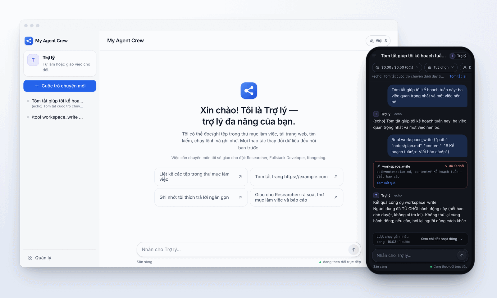

# my-agent-crew

A crew of agents running locally, with a friendly web UI and a single place to chat. Agents read/write files
in the working directory, run shell, fetch web pages, search, read images and PDFs, remember long term —
and **ask you first** before every operation that changes data, except the commands you have said are familiar.

You only talk to one master agent; it does the small work itself and delegates the big work to the right person
in the crew. Running work shows as a step-by-step timeline, so you always see what the agent is doing.

This is a lean rewrite of [my-crew](https://github.com/phuc-nt/my-crew): drops the router and the DAG,
keeps agents + tools + skills + memory, and puts the web UI up front.



## Run

```bash
uv sync
OPENROUTER_API_KEY=... uv run python -m my_agent_crew
# open http://127.0.0.1:8765
```

No key? Try it with the echo provider (no real model calls):

```bash
MY_AGENT_ROUTES=fake:echo uv run python -m my_agent_crew
```

In echo mode, type `/tool <name> {json}` to call a tool directly, for example
`/tool workspace_list {"path":"."}`.

To check that your own agents still behave after a change to a persona, a prompt or a tool set,
play written cases against a throwaway copy of your home with the real model (costs money; the
live crew is not touched):

```bash
OPENROUTER_API_KEY=... uv run python scripts/run_evals.py --runs 3 --max-usd 0.5
```

## Configuration

Secrets are read **only** from environment variables; `config.yaml` holds only non-sensitive keys.

| Environment variable | Meaning | Default |
|---|---|---|
| `MY_AGENT_HOME` | data directory (db, workspace/, skills/, config.yaml) | `~/.my-agent-crew` |
| `MY_AGENT_ROUTES` | route chain of `provider:model`, comma-separated, tried in order | `openrouter:deepseek/deepseek-v4-flash` |
| `MY_AGENT_COST_CAP_USD` | default budget per conversation (0 = unlimited) | `0.5` |
| `MY_AGENT_MAX_STEPS` | maximum number of model calls in one turn | `12` |
| `MY_AGENT_AUTONOMOUS` | `1` to let write/mutating tools run without approval | off |
| `MY_AGENT_APPROVAL_TTL_SECONDS` | an approval request nobody answers within this window is auto-denied and the turn continues | `600` |
| `MY_AGENT_TIMEZONE` | your timezone (IANA name, e.g. `Asia/Ho_Chi_Minh`) for schedules, "today" in the prompt and statistics; the DB still stores UTC | machine timezone |
| `MY_AGENT_ALLOWED_HOSTS` | host names (besides `localhost` and IPs) allowed to call the API, comma-separated — e.g. a Tailscale MagicDNS name | empty |
| `MY_AGENT_WEB_URL` | the address you open the web UI at (plain `http`/`https`: host, port and path only), used for the canvas links sent to Telegram; wins over `web_url` in `config.yaml`; a host name here also needs `MY_AGENT_ALLOWED_HOSTS` | empty (no links) |
| `OLLAMA_BASE_URL` | where local ollama listens; no key needed, so this provider is always available | `http://127.0.0.1:11434/v1` |
| `OPENROUTER_API_KEY` | enables the OpenRouter provider | — |
| `TAVILY_API_KEY` / `BRAVE_API_KEY` | paid search sources; if unset, `web_search` still runs via DuckDuckGo | — |
| `FIRECRAWL_BASE_URL` | firecrawl host for search and for reading pages as markdown | — |
| `FIRECRAWL_API_KEY` | only needed with firecrawl cloud | — |
| the name given by `telegram.token_env` (e.g. `TELEGRAM_BOT_TOKEN`) | the master's Telegram bot token; missing means the channel is off | — |

`config.yaml` in `MY_AGENT_HOME` accepts exactly these keys: `routes`, `vision_routes`,
`audio_routes`, `cost_cap_usd`, `max_steps`, `language`, `timezone`, `autonomous_default`,
`approval_ttl_seconds`, `tool_output_chars`, `shell_ask_patterns`, `shell_allow_patterns`,
`openrouter_providers`, `openrouter_provider_fallbacks`, `web_url`, `mcp_servers`.
An unknown key makes the server fail at startup, so one typo does not silently disable a setting.
Details of each key: [docs/agents.md](docs/agents.md#agentyaml).
Your own skills: add a `.md` file with `name` in its frontmatter to `skills/`.
Skills that are not pinned only show their name + description in the prompt; the model calls `skill_read` to read the full text.
A skill that calls an external program declares `requires.bins: [gws]` and `cliHelp: gws --help`:
if the program is missing the skill is still kept but opens with a warning, and `cliHelp` reminds the
model to read `--help` once instead of guessing the syntax a third time.
Copyable samples: [docs/examples/skills/](docs/examples/skills/) — copy into `skills/` and fill in the blanks.

## Multiple named agents

Each directory `MY_AGENT_HOME/agents/<id>/` holds an `agent.yaml` together with the persona files
(`AGENTS.md`, `SOUL.md`, `IDENTITY.md`, `USER.md`) and memory (`MEMORY.md`, `memory/YYYY-MM-DD.md`)
that are loaded into the system prompt every turn. Example of a health coach:

```yaml
name: HLV sức khoẻ
description: Đọc dữ liệu Garmin, gửi bản tin sáng
routes: [openrouter:z-ai/glm-5.3-flash, openrouter:z-ai/glm-5]
workspace: ~/workspace/my-health-coach   # sandbox for file tools + shell_run
skills_dirs: [~/workspace/shared-skills]  # shared skills outside the home
autonomous: true                          # jobs run without approval
schedules:
  - id: morning-brief
    name: Bản tin sáng
    cron: "0 7 * * *"                     # machine time, 5 fields
    skills: [garmin]                      # pin skills for this run
    prompt: |
      Chạy scripts/health-sync.py --json rồi viết bản tin 4-6 dòng…
      Kèm ảnh bằng dòng `MEDIA: data/charts/sleep.png`,
      kèm tệp bằng dòng `FILE: data/tuan-nay.csv`.
  - id: backup
    name: Sao lưu Drive
    cron: "20 2 * * *"
    command: ./scripts/backup-to-drive.sh
memory_consolidate: "30 3 * * 1"            # every Monday, rewrite MEMORY.md from the daily notes
```

An agent holding data that must not leave the machine (a ledger, say) sets `shell_network: false`: every `shell_run`
runs inside `sandbox-exec` with no network and can only write under `shell_write_paths` — see [agents.md](docs/agents.md).
`shell_write_paths` alone keeps the network but still confines writes, for an agent that works inside a repo it
must not edit; `shell_deny_patterns` refuses command shapes outright.

An agent may also name one `escalation_route` (a `provider:model` that is not one of its own routes): a turn moves
to it only when it is stuck — the loop guard is about to halt it for repeating one call, or every route failed before
any text was shown — and at most once; the next turn starts on the usual routes again. It is off unless the agent's
own file sets it, and running out of steps or budget never moves a turn.

A `prompt` job opens a new conversation and runs as if the user had sent a message; a `command` job only runs the shell.
The result of a `prompt` job is sent to the Telegram chat (if there is a bot, see below) with a first line `[Agent name]`;
a `MEDIA:` line becomes an image taken from that agent's workspace, a `FILE:` line becomes an attached file
(`pdf`, `csv`, `md`, `txt`, `xlsx`, `json`, `zip`, up to 20 MB) — images get recompressed, so charts are
sent with `MEDIA:`, while tables of numbers must be sent with `FILE:` to keep the bytes intact. A `FILE:`
line that names a picture (`png`, `jpg`, `jpeg`, `webp`) is sent as a photo too, not refused.

## Bring your `.claude/` / `.opencode/` kit over

Already have subagents, commands, skills and hooks from Claude Code or opencode? Copy the directory as is into
the home and it just works, no rewrite needed:

```
cp -r ~/.claude ~/.my-agent-crew/.agents     # or keep the name .claude / .opencode, read the same way
```

- `agents/<id>.md` (front matter `name`, `description`, `tools`, `model` + the body as the persona)
  → one crew member; an `agent.yaml` with the same id always wins.
- `commands/**/*.md` → `/name` commands (`commands/mk/plan.md` is `/mk:plan`), taking `$ARGUMENTS`,
  `$1`…`$9`; usable on the web and on Telegram alike.
- `skills/` → added to the skill path; `settings.json` `hooks.PreToolUse/PostToolUse` → hooks run
  before/after every tool with the familiar JSON on stdin (`Bash` maps to `shell_run`, exit 2 blocks).
- Kits are read only from the home and from the agent directory. The repo the agent works in (the workspace) is a
  data source: the repo's `.claude/` and `AGENTS.md` are for the repo's developers and do not affect
  the crew's agents.

Details: [docs/agents.md](docs/agents.md#kit-agents-claude-opencode).

## Reading images and PDFs

Images sent via Telegram are saved to `workspace/inbox/`; every agent has the `image_read` tool
(path + question), which sends the image to the `vision_routes` chain (by default two cheap vision models on
OpenRouter) and gets a text answer back. The master looks once to know whom to hand it to; the agent taking
the job looks again with its own question. Set `vision_routes: []` to turn it off.

`pdf_read` reads documents by the same path. Typeset pages have their text extracted for free;
only scanned pages are rendered and sent through `vision_routes`, once per page — so a document
mixing both kinds only costs money for exactly the scanned pages. Without `vision_routes` configured, typeset
PDFs are still readable.

## Voice notes

A voice note (or audio file) sent on Telegram is downloaded and transcribed by the `audio_routes`
chain (by default `google/gemini-2.5-flash-lite` on OpenRouter) before the master ever sees it —
the chat model cannot hear audio. The channel replies "Đã nghe: …" with the transcript so the
sender can catch a mishearing, then hands that text to the master as an ordinary message; it is
never read as a slash command or a `/steer`, whatever it starts with. A note over 300 seconds or
10 MB, or in a format none of `mp3/m4a/ogg/wav/flac/aac` covers, is refused before it is
downloaded. Transcription cost is recorded under the `transcribe` purpose in the cost ledger. Set
`audio_routes: []` to turn it off — the channel then tells the sender how to enable it instead of
downloading the note.

## While an agent is busy

A message that reaches a conversation mid-turn is not refused. A plain message waits its turn:
it is answered by its own turn once the running one ends, together with anything else queued
beside it (at most 20 per conversation). A message that starts with `/steer <text>`, or with one
of the agent's own kit commands, is slipped into the running turn at its next tool boundary
instead, so a correction lands while the work is still going. On the web the send button says
which will happen (**Xếp hàng**, queue, or **Chèn**, insert) and the waiting message shows
under the thread. On Telegram the bot answers at once that the message is queued, `/status`
counts the queue, and turns run in the background so the bot keeps answering meanwhile;
`/new` is refused while a turn runs or messages wait. `POST /api/inbound` answers a queued
message with `"status": "queued"` — read the conversation back for the reply.

## A turn outlives its tab and a restart

A turn started from the web belongs to the server, not to the tab that sent the message. Reload
the page, close it, open a second tab or come back from another conversation: the turn is read
to its end, and a tab opened in the middle shows what has been written so far and follows it
live, whoever started it (another tab, Telegram, a job). Stop is what ends a turn, from any tab.
The text being written is kept in memory only; the stored conversation is the whole truth.

A message sent twice is said once: each send from the web carries a `request_id`, so when the
answer to a send is lost on the way back and the same words are sent again, nothing new is
stored and no second turn starts.

A turn cut by a server restart is carried on when the server is back, once. The run is reopened
as the same run and goes on from the stored conversation. A tool call that only reads is simply
made again; a call to anything else that may already have run is closed with a note saying
nobody knows whether it ran, and the model decides after looking, so nothing that writes, sends
or pays is done twice unseen. A turn is not carried on when its conversation waits on a
decision, was deleted, has had a later turn or has spent its budget, when it is a Telegram turn
and no bot is up, or when the server runs with `--no-schedule`.

## Ask instead of guessing

At a real fork in the road, the agent calls `ask_user` to ask rather than choosing on its own — even when `autonomous` is
on, because auto-approving a question means nobody answers it. The question shows as a card with ready-made choices on the
web, and on Telegram you answer by number or in words. A timeout is not a denial:
the agent receives the declared `default`, moves on, and states in its reply that it decided on its own, so a
job running while nobody is watching should always include a `default`.

## Long tool output

A tool result too long for the output cap is shortened in the prompt, but the whole text is
kept under `spill/<conversation>/` in the home (at most 5 MB a file) and the shortened text ends
with a line naming the call. The agent reads the rest with `tool_output_read`, in segments that
always fit the cap, instead of running the command again. It reads only its own conversation;
a conversation's spill goes with it, a fork gets its own copy, and a daily sweep removes files
older than seven days. Agents without a `tools:` list have it; an agent with its own list needs
`tool_output_read` added there.

## Tools from MCP servers

An agent can use the tools of remote MCP servers (streamable HTTP; stdio servers are not run).
A server is declared once under `mcp_servers` in `config.yaml` and handed to an agent by name,
with `mcp:` in its `agent.yaml` or the **Máy chủ MCP** boxes in the agent editor:

```yaml
# config.yaml — no key lives here: a header takes its value from the environment
mcp_servers:
  notion:
    url: https://mcp.notion.com/mcp
    description: Trang và cơ sở dữ liệu Notion
    read_only: [notion-search, notion-fetch]   # only these run without asking
```

A server's tools are named `mcp__<server>__<tool>`. Every one of them asks before it runs, and
is never made again after a restart, until you list it under `read_only`; what a server says
about its own tools decides nothing. A server that answers 401 with no key of its own can be
signed in to from **Kết nối** (OAuth as a public client), from a browser on the machine the
crew runs on; tokens are kept beside the provider keys and shown by no API. A server that is
down is a row that says why, never a crew that does not start.

To keep the prompt small, a server's tools are `deferred` unless the file says otherwise: the
model is not told of them on every call, and finds them with `tool_search`, which loads the best
matches for the rest of the conversation. A tool that is both listed under `read_only` and let
in as `codemode` (set per tool with `tool_exposure`) can also be called from `tool_script`: the
model writes a short Python-like script that makes up to 25 read-only calls and only what it
prints comes back, so a job that needs one tool twenty times does not pay for twenty answers in
context. A script may call only tools that read and ask nobody; anything that
writes ends the script with a line saying to call it directly, where the approval gate sees it.
The script runs in a process of its own with an empty environment and limits on memory, CPU and
time, and on macOS inside a sandbox with no network and no writes.
Details: [docs/tools.md](docs/tools.md#máy-chủ-mcp).

## Canvas

A canvas is a versioned document that you and an agent edit together. The agent writes one for
anything you will keep working on — a plan, a report, a script, a page, a diagram — and keeps
answers you read once in the chat. The kinds are `markdown`, `code`, `html`, `svg` and
`mermaid`, plus `image`, which only comes in by import.

Agents work through seven tools: `artifact_create`, `artifact_list`, `artifact_read`,
`artifact_edit`, `artifact_rewrite`, `artifact_import` and `artifact_export`. Only
`artifact_export` asks for approval, because it writes over a workspace file; the others do
not, since every version of a canvas is kept. `artifact_import` turns a workspace file into a
canvas, or into a new version of one, and `artifact_export` writes a canvas out to a workspace
file. Agents without a `tools:` list have all seven; an agent with its own list has only the
ones named there.

On the web a canvas opens in a panel beside the chat, where you read it or edit it yourself.
Your next message tells the agent what you changed, so it does not write over your work.
**Lịch sử** (history) lists the versions, and **Khôi phục bản này** (restore this version)
brings an old one back as a new version, so nothing in between is lost. An HTML or Mermaid
canvas runs as a page in an isolated frame: it cannot reach the app or send anything out, and
loads scripts, styles and fonts only from a few public CDNs. An SVG shows as a picture, so
nothing in it runs. While the agent writes, the canvas fills in as a live preview; the switch
**Xem trước canvas khi agent đang viết** under **Cài đặt** turns that off for the device in
hand. The **Canvas** tab of the manage screen is the library: every canvas, whichever
conversation it was written in.

On Telegram a reply line `FILE: artifact:<id>` sends that canvas as a file, and a turn that
wrote canvases ends with a list of them ("Canvas vừa ghi:"), at most ten by name. Each gets a
link to the web UI when `web_url` is set. A turn from the web chat, Telegram or a scheduled
job may write canvases, and so may an agent delegated from one; a turn from
`POST /api/inbound` can only list, read and export.

Details: [docs/canvas.md](docs/canvas.md).

## One assistant directs the whole crew

The web UI and Telegram have only **one** place to chat: with the main agent (`default`, called the *master*). It
does the small work itself and delegates the big work to the right person with the `delegate` tool, then puts it together — you
do not have to pick an agent. Every other agent in the home (including Pong or the health coach) is by default
someone the master can delegate to; the **Đội** tab in the manage screen lists the whole crew and installs new roles from templates with
one click. Customize the master via `~/.my-agent-crew/agent.yaml` (name, description, `autonomous`,
`cost_cap_usd`, `max_steps`, or `delegates` to narrow the crew).

**Telegram** is the same mechanism on your phone. Declare the bot in the master's `agent.yaml`:

```yaml
telegram:
  token_env: TELEGRAM_BOT_TOKEN   # the NAME of the env var holding the token, not the token
  chat_id: 123456789              # the only chat that gets replies
```

The server polls that bot: messages from `chat_id` become the master's chat turns by day, the master delegates
work to Pong/the coach when needed and replies back to the chat; images or files you send are saved to the `inbox/` of the
master's workspace and the master passes the path to the agent that needs to read it. Slash commands (`/new`, `/help`,
`/status`, `/tools`, `/approve`, `/deny`) are answered by the channel itself, costing no model turn. A
`telegram` block placed on another agent is ignored with a warning.

Three templates available: `fullstack-developer` takes a software task end to end (scout, plan,
code, test, self-review, commit) and may consult the other two; `kongming` is a read-only adviser
for hard design or debugging calls — pin your strongest model in its `routes`; `researcher`
researches any topic on the web and returns a ranked recommendation with sources. Templates use
the home's shared workspace; `--workspace` pins that role (and the peers it brings) to one
repository. Install via CLI or the **Đội** tab in the manage screen — web installs join the
running crew immediately; CLI installs need a server restart.

```bash
python -m my_agent_crew agent list-templates                                  # see the three templates
python -m my_agent_crew agent add fullstack-developer --workspace ~/src/app   # plus kongming and researcher
python -m my_agent_crew agent add researcher                                  # just the researcher
```

Edit an agent's profile (name, description, routes, tools, budget, schedules) from the **Đội** tab.
Tools across the whole crew, and who uses which, are in **Công cụ** (tools). Connections are in **Kết nối** (connections):
set, check or remove API keys, host addresses and the Telegram bot token there — they are
written to `~/.my-agent-crew/env` and take effect without a restart. A change the crew
could not run with (removing the only model key) is refused before anything is written.
The model routes every agent falls back on are edited on the same page and saved to
`config.yaml` (read-only there while `MY_AGENT_ROUTES` is set).
The server only answers requests addressed to `localhost` or an IP, from its own page; to open the UI by a host
name (Tailscale MagicDNS, say), list it in `MY_AGENT_ALLOWED_HOSTS` — the 403 names the host to add.
There is no login: whoever reaches the port drives the crew, `POST /api/inbound` included.
Keep it on the machine or a private tailnet, never behind a public tunnel.

Delegate as you would to a person: *"Ask fullstack-developer to add a `--version` command that prints the version from
pyproject, with tests."* The master delegates, fullstack-developer scouts, writes, tests and reviews on its own, asking
kongming when stuck — every delegation is a child conversation that shows right away in the manage screen, with its cost and
step count.
Delegation is only one level deep: a child agent does not delegate further to anyone.

Every platform goes through **one backend entry point**: the web, Telegram and `POST /api/inbound` (JSON, synchronous
reply) all feed messages into the same place, so a backend upgrade reaches every platform at once, and
testing a feature only takes sending a request:

```bash
curl -s http://127.0.0.1:8765/api/inbound -H 'content-type: application/json' \
  -d '{"text":"Nhờ kongming liệt kê thư mục làm việc rồi tóm tắt 2 câu."}'
# → {"conversation_id":…,"agent_id":"default","text":"…","status":"done","steps":2}
```

## Memory

Memory is Markdown on disk, split into two scopes: **shared, about you** (`users/owner/USER.md` plus
the event files in `facts/`) — every agent reads it, so telling one agent means the whole crew knows — and
**private to each agent** (`MEMORY.md` + the `memory/YYYY-MM-DD.md` daily notes) for the work it does itself.

Writes the person is present for land immediately; writes from unattended jobs become
proposals and wait for approval. Set `memory_consolidate` to have an agent periodically rewrite
its `MEMORY.md` from recent notes — also a proposal, keeping the old text for undo. The **Ghi nhớ**
tab in the manage screen edits everything: `USER.md`, facts, agent `MEMORY.md`, daily notes,
search both scopes, approve/deny proposals, and trigger consolidation immediately.

Each line in `MEMORY.md` can end with the day it was last confirmed, `(YYYY-MM-DD)`. The next
consolidation looks again at undated lines and lines older than 90 days, and says why it kept,
changed or dropped each one; a newer note wins over an older line that contradicts it. Even for
an `autonomous` agent, the code (not the model) decides whether a rewrite applies on its own:
one that only adds lines or refreshes dates does, while one that drops or rewords a line, or
invents a date, waits for a person with its reasons on the card.

At the same time, the agent gathers the daily notes into a **wiki vault** (`memory/wiki/`): one Markdown page per
topic, sorted into `entities` / `concepts` / `syntheses` and linked to each other with
`[[page name]]` — in place of vector search. The daily notes answer "what happened that day", the wiki answers
"what do we know about this topic". `wiki_apply` refuses pages that do not declare `sources`, so no
made-up page can slip through; lint also calls out pages whose sources have gone missing. On each rebuild only
the machine-written part is replaced, the human-written part stays. View, edit and rebuild in the **Wiki** tab
under **Ghi nhớ**, where a page reads as rendered prose whose `[[links]]` lead to their pages, one
tap marks it fine, and the vault's open questions and today's note open from above the page list.
Details: [docs/memory.md](docs/memory.md).

What was said stays findable too. `conversation_search` searches the words of past
conversations (SQLite FTS5; typing without Vietnamese accents still matches accented text): an
agent searches its own, the master any one agent's or the whole crew's, and the conversation
still running is left out. On the web, the conversation list's search matches titles and, under
**Trong nội dung** (in the content), the text inside messages.

Details on agent configuration, tools, memory and channels: [docs/agents.md](docs/agents.md),
[docs/tools.md](docs/tools.md), [docs/memory.md](docs/memory.md),
[docs/channels.md](docs/channels.md). The `agents/` directory is personal data and is not part of
this repo.

## Activity tracking

Web UI split into two: chat with the master on the left, and a **manage screen** on the right
accessible via `#/manage/<section>`. The UI is in Vietnamese, so the sections are named below as
they appear on screen:

- **Hoạt động** (activity): **Cần bạn xử lý** (needs you) lists the runs that failed or halted,
  each with **Đã xem** (seen) to put it away in this browser; **Đang chạy** (running) shows live
  runs with their steps — model call, tool call, result, time, cost, and for a finished model call
  its route, the wait for the first token and the prompt tokens with the part served from the
  provider's cache; **Gần đây** (recent) is the stored run history, narrowed by agent on the
  server and by status and source in the page, remembered in this browser, folded behind one
  **Lọc** (filter) toggle on a phone, and reaching further back with **Xem thêm** (show more).
  A run also opens on its own timeline, which downloads as JSON or Markdown (**Tải JSON**,
  **Tải Markdown**) — tool arguments and results included, keys masked on a best-effort basis, so
  read it before pasting it anywhere. The nav entry counts the runs running and the failures
  not yet seen.
- **Duyệt** (approvals): the requests waiting on you come first and are decided in place —
  approve, deny, or answer a question — with a countdown to their deadline and **Xem đầy đủ**
  (show all) for a call's whole arguments; **Lịch sử duyệt** (approval history) below lists the
  decided requests with their outcome (approved, denied, expired, answered). The nav entry, a
  "(N)" before the tab title and the installed app's badge count the requests waiting, and
  **Quản lý** (manage) opens here while one waits.
- **Lịch chạy** (jobs): each schedule's timing in words ("Mỗi ngày 07:00") beside its raw cron or
  interval; the next and last run as relative times, with the local clock time printed on the
  row; how the last run ended (a status badge, its summary and a link to that run); run-now and
  pause/resume buttons; and **Sửa lịch** (edit schedule), which opens the agent's editor at its
  schedules, where jobs are added, changed or turned on. The nav entry shows a red count of the
  jobs whose latest run failed. An agent can propose its own repeating job with
  `schedule_create`; it always waits in **Duyệt** with the verbatim prompt, the timing in words
  and the next runs — even in an `autonomous` conversation, and no setting turns that off. An
  approved job is stored in the database, runs without a restart and is listed here.
- **Chi phí** (costs): today and the last seven days on the viewer's calendar, then spend, tokens
  and the share of the prompt served from cache, by agent / model / day, and by purpose
  (**Theo mục đích**): every model call is on the ledger, including the side calls for titles,
  summaries, image and PDF reading, voice transcription, memory consolidation and the wiki.
- **Ghi nhớ** (memory — split further into **Về bạn**, **Của agent**, **Wiki**, **Tìm** and
  **Đề xuất**): a proposal shows the lines it drops beside those it adds, or the exact fact it
  touches, before it is approved.
- **Canvas**: the library of every canvas, searched by name, with the space they take; a canvas
  opens on a page of its own from there. See [Canvas](#canvas).
- **Đội** (crew), **Công cụ** (tools), **Kết nối** (connections), **Cài đặt** (settings, which
  also names the page's build and the server's).

Inside the chat, a conversation-activity view shows only that conversation's own runs, step by
step, runs from before the page opened included. The header shows the agent's avatar (its initial
on its own colour) next to its name; the `Đội: N` (crew) chip opens the manage screen at the crew
section. A line `MEDIA: <path in workspace>` in the reply is rendered as an image, and
`FILE: <path>` as a download link; a file the person sent through Telegram shows in their message
as a thumbnail or a download chip. When the agent is about to do a long task, it calls
`progress_note` to say in one short sentence what it is doing, and that sentence shows right away
on the timeline so the viewer sees progress instead of a spinner. Also in the chat:

- The conversation list files its rows under **Hôm nay** / **Hôm qua** / **Cũ hơn** (today,
  yesterday, older) on the viewer's own calendar, says how long ago each one changed, and puts an
  unread dot on a conversation that changed since this browser last had it open. The composer
  keeps each conversation's unsent draft across switches and reloads.
- **Sửa và gửi lại từ đây** (edit and resend from here) under a message of yours forks the
  conversation there: a new conversation holds everything before it, the composer opens with
  that message to edit, and a line "Rẽ nhánh từ …" (forked from) leads back. The original is left
  untouched, and the fork starts with no spend and no standing approvals.
- A `/` at the start of the composer lists the commands of the agent the conversation talks to,
  narrowed as the name is typed.
- Each agent reply can be copied, or shared where the device has a share sheet, and each code
  block has its own copy button; where the browser refuses the clipboard, the text is shown to
  copy by hand. The conversation's options export it as `<title>.md`.
- The budget pill's card and the over-budget notices raise the conversation's cost cap by a step
  or set a new one, 0 lifting it; a spent budget locks the composer until then.
- **Dừng** (stop) cuts the turn's stream, a decision's or an answer's included, and says the turn
  stopped. A run another channel starts in the open conversation shows in the thread, which
  reloads once that run ends or pauses for approval. The status pill says when the live stream
  is connecting, lost or offline, and offers **Thử lại** (retry).
- When the server is restarted on a newer build, a **Có bản mới** (new version) bar offers a
  reload.

## Development

```bash
./scripts/gates.sh               # every CI gate, stops at the first red gate
```

Or run each gate on its own:

```bash
uv run ruff check .              # lint
uv run ruff format --check .     # formatting — a separate gate, a green `ruff check` does not replace it
uv run pytest -q                 # backend
cd web && npm ci
npm run typecheck && npm test    # frontend unit
npm run e2e                      # Playwright (mocks /api in the browser)
npm run bundle                   # rebuild the bundle into my_agent_crew/server/static (committed)
```

Playwright's dev server listens on 4173; `E2E_PORT=<port> npm run e2e` moves it when two
checkouts run their browser tests at once, since on a shared port the second run would quietly
test the first one's sources. Vitest and Playwright both run in the Asia/Ho_Chi_Minh time zone,
so day boundaries ("today", "yesterday") fall in the same place on a laptop and on CI, which runs
in UTC.

What each gate does and why: [docs/code-standards.md §4](docs/code-standards.md#4-cổng-phải-chạy-trước-khi-commit).
Changes per release: [CHANGELOG.md](CHANGELOG.md). How to release a version:
[docs/deployment-guide.md §6b](docs/deployment-guide.md#6b-phát-hành-một-phiên-bản).

Read [docs/design.md](docs/design.md) to understand the design decisions,
[docs/testing.md](docs/testing.md) to know which feature is tested at which layer, and the reference
set [agents](docs/agents.md) · [tools](docs/tools.md) · [memory](docs/memory.md) ·
[channels](docs/channels.md).
