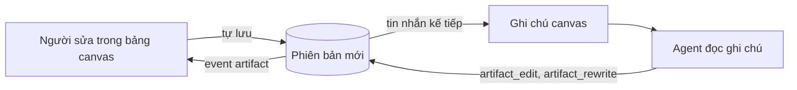

# Canvas

**Phiên bản**: 0.10.0 · **Cập nhật**: 2026-10-05

Canvas là tài liệu có phiên bản mà người và agent cùng sửa. Nó mở cạnh khung chat trên web,
sống lâu hơn cuộc trò chuyện đã sinh ra nó, và mỗi lần ghi là một phiên bản mới. Trang này nói
canvas dùng để làm gì, ai ghi được gì, và những hợp đồng người dùng thấy: tên tool, endpoint,
event, tên tệp gửi qua Telegram. Tham số từng tool nằm ở [tools.md](tools.md#canvas).

## 1. Canvas là gì, khi nào dùng

Chat hợp với câu trả lời đọc một lần. Canvas dành cho nội dung dài hoặc có cấu trúc mà người sẽ
đọc lại, sửa hay dùng tiếp: kế hoạch, báo cáo, bản nháp, một tệp code hoàn chỉnh, một trang web,
một hình vẽ, một sơ đồ. Mô tả của `artifact_create` dặn agent đúng như vậy: câu hỏi và trao đổi
thì để trong chat, và sau khi tạo canvas thì câu trả lời chỉ nói ngắn đã viết gì, không chép lại
nội dung.

Khi người nhận không ngồi ở web chat (lượt qua Telegram, lượt của job), agent được dặn chặt hơn:
chỉ tạo canvas khi được dặn, hoặc khi tài liệu dài và sẽ còn sửa tiếp. Người cũng tự tạo được
canvas: nút "Canvas" trên một hội thoại mở "Canvas của hội thoại", trong đó có "Canvas mới".

## 2. Loại nội dung và trần cỡ

Trần cỡ tính cho **một phiên bản**. Bản vượt trần bị từ chối nguyên vẹn, không lưu gì.

| Loại | Trần một phiên bản | Ai tạo được | Hiện ra thế nào |
|---|---|---|---|
| `markdown` | 512 KB | người, agent | văn bản đã dựng; "Sửa" cho mã nguồn |
| `code` | 512 KB | người, agent | mã nguồn, kèm tên ngôn ngữ (tối đa 40 ký tự) |
| `mermaid` | 512 KB | người, agent | sơ đồ, vẽ trong khung cách ly |
| `html` | 4 MB | người, agent | trang chạy trong khung cách ly |
| `svg` | 2 MB | người, agent | một bức hình, không chạy script |
| `image` | 2 MB | chỉ qua `artifact_import` | ảnh PNG, JPEG, GIF hoặc WebP |

- Ảnh được nhận theo chính các byte của tệp, không theo đuôi tệp. Canvas ảnh không sửa được
  bằng chữ và `artifact_read` không đọc được nó.
- Tiêu đề phải có chữ và dài tối đa 200 ký tự. Xuống dòng kiểu Windows được đổi về một kiểu
  khi lưu.
- Toàn bộ canvas của máy chủ có một trần lưu trữ chung là 1024 MB, tính trên mọi phiên bản.
  Agent bị dừng ghi khi kho đã dùng 90% trần; người vẫn ghi tiếp được tới hết trần. Khi kho
  đầy, bảng canvas báo "Máy chủ hết chỗ lưu canvas. Các canvas lớn nhất:" và tự lưu tạm dừng.

## 3. Vòng sửa chung

1. **Người sửa.** Bảng canvas có hai chế độ "Xem" và "Sửa". Chữ đang gõ được tự lưu sau 1,5
   giây ngừng gõ; Cmd/Ctrl+S lưu ngay. Dòng trạng thái nói "Đã lưu", "Đang lưu…", "Chưa lưu".
2. **Tin nhắn mang ghi chú canvas.** Agent không cần gọi tool để biết người đã sửa gì. Tin nhắn
   kế tiếp của người được lưu kèm một ghi chú canvas, và model đọc ghi chú đó ngay trước tin
   nhắn. Ghi chú nêu mỗi canvas của hội thoại đã đổi từ lần cuối agent thấy nó: diff phần người
   tự sửa cho nhiều nhất ba canvas, canvas mới đổi nhất trước, mỗi diff tối đa 3000 ký tự và cả
   ghi chú tối đa 8000 ký tự. Phiên bản của agent khác, một lần khôi phục hay một thay đổi quá
   dài chỉ được nêu bằng một dòng dặn agent đọc lại. Canvas không vừa ghi chú được đếm ở dòng
   cuối.
3. **Canvas đang mở.** Chỉ tin nhắn từ web chat mới nêu thêm canvas đang mở trên thiết bị gửi
   tin và đoạn đang chọn trong đó. Tin gửi lúc canvas còn chữ chưa lưu thì chờ lần lưu cuối
   ("Đang lưu canvas…").
4. **Agent sửa.** Agent sửa bằng tool (mục [6](#6-bảy-tool-của-agent)). Mỗi lần ghi hiện thành
   một thẻ trong luồng chat: tiêu đề, việc đã làm ("Đã tạo", "Đã sửa", "Đã viết lại", "Đã nhập",
   "Đã nhập lại", "Không đổi"), số phiên bản và nút "Mở".
5. **Hai bên cùng sửa.** Nếu agent lưu trong lúc người đang gõ, hai bản được gộp khi chúng đổi
   những dòng khác nhau. Khi không gộp được, một thanh báo "Có hai bản khác nhau" kèm diff, với
   hai lựa chọn "Giữ bản của tôi" và "Nạp bản mới"; nạp bản mới thì "Hoàn tác" được. Phía agent,
   `artifact_rewrite` bị từ chối nếu canvas đã đổi từ lúc agent đọc, và agent nhận diff của phần
   người khác đã đổi.

Người thấy ghi chú mà agent đã đọc: dưới tin nhắn có một chip "Kèm ngữ cảnh canvas", mở ra là
nguyên văn ghi chú, có nút "Sao chép ghi chú canvas".

Trên màn hình rộng từ 1101 px, canvas là cột bên phải của bố cục, kéo được bề rộng và hẹp nhất
360 px. Dưới ngưỡng đó nó phủ lên khung chat; "← Chat" hoặc Escape đóng nó lại.

## 4. Hỏi về một đoạn

Chọn một đoạn trong canvas, ở chế độ "Sửa" hay "Xem", thì chân bảng hiện thanh "Hỏi về đoạn đã
chọn": nó nêu các dòng chứa đoạn chọn và có ô "Câu hỏi về đoạn này". Câu hỏi đi thành một tin
nhắn, kèm đoạn chọn theo đúng phiên bản vừa lưu, nên số dòng agent thấy là số dòng người thấy.

- Ở chế độ "Xem", một đoạn văn, một mục danh sách, một hàng bảng hay một khối code được tính
  trọn các dòng của nó. Khi phần gửi đi dài hơn hẳn phần đã chọn, thanh nói rõ và gợi ý chuyển
  sang "Sửa".
- Đoạn chọn dài tối đa 20000 ký tự; dài hơn thì bị cắt ở cuối một dòng.
- Hỏi bị tắt khi agent đang chạy, khi hội thoại đang chờ duyệt, và khi hội thoại hết ngân sách.
  Thanh nói lý do nào.
- Canvas vừa đổi thì thanh báo "Canvas vừa đổi, hãy chọn lại đoạn cần hỏi". Máy chủ từ chối
  (mã 422) một đoạn chọn không còn khớp với canvas, và không xếp tin nhắn nào.

## 5. Lịch sử

Nút "Lịch sử" mở "Lịch sử phiên bản": mọi phiên bản còn lưu, ai viết, lúc nào, và diff so với
bản trước.

**Khi nào các lần lưu của người gộp làm một.** Một lần lưu của người ghi đè lên phiên bản mới
nhất thay vì tạo phiên bản mới khi đủ cả bốn điều: phiên bản mới nhất cũng do người viết; cả
hai không mang ghi chú (không phải bản khôi phục hay bản nhập từ tệp); phiên bản mới nhất được
tạo chưa quá 120 giây; và chưa hội thoại nào đã thấy, đã đọc hay đã được báo về nó. Điều cuối
giữ cho phiên bản mà agent từng đọc không bao giờ đổi dưới tay nó. Mọi lần ghi của agent là một
phiên bản riêng.

**Khôi phục.** "Khôi phục bản này" không xoá gì: nó chép một bản cũ thành phiên bản mới nhất,
ghi chú "Khôi phục từ v…", sau khi chữ đang gõ đã được lưu. Bản nhập từ tệp mang ghi chú "Nhập
từ tệp".

**Bản nháp trên trình duyệt.** Chữ chưa lưu được (mất mạng, máy chủ không phản hồi, kho đầy)
nằm trong một bản nháp trên thiết bị đó. Trình duyệt giữ mười bản nháp mới nhất, mỗi bản tối đa
30 ngày. Mở lại canvas thì bản nháp được mở ("Đã mở bản nháp chưa lưu trên máy này.") hoặc gộp
với bản mới hơn trên máy chủ. Thiết bị không cho lưu bản nháp thì chữ chỉ còn trong tab.

## 6. Bảy tool của agent

| Tool | Làm gì | Duyệt | Giới hạn |
|---|---|---|---|
| `artifact_create` | tạo canvas loại chữ: `markdown`, `code`, `html`, `svg`, `mermaid` | không | 30 canvas mới mỗi lượt |
| `artifact_list` | liệt kê canvas agent với tới, mới sửa trước, đánh dấu bản chưa thấy | không | 30 canvas |
| `artifact_read` | đọc nguyên văn theo trang (`version`, `from_line`, `lines`) | không | một trang vừa trần đầu ra của agent |
| `artifact_edit` | thay đoạn `old` bằng `new`; `replace_all`; đổi `title` | không | 30 lần ghi mỗi canvas mỗi lượt |
| `artifact_rewrite` | viết lại cả canvas | không | như trên; phải đọc hết bản mới nhất trước |
| `artifact_import` | đọc một tệp workspace thành canvas, mới hoặc đã có | không | tính như một lần ghi |
| `artifact_export` | ghi phiên bản mới nhất ra một tệp workspace | **có** | không tính là lần ghi canvas |

- Một lần ghi không đổi gì thì không tạo phiên bản và không tính vào giới hạn. Chạm giới hạn
  thì tool trả lời rằng chưa ghi gì và dặn agent báo người; lượt sau ghi tiếp được.
- Canvas ngoài tầm với và canvas không tồn tại được trả lời bằng cùng một câu, nên agent không
  dò được id nào có thật.
- Agent có danh sách `tools:` trong [`agent.yaml`](agents.md#agentyaml) chỉ nhận những tool
  canvas mà danh sách đó nêu.
- Chỉ `artifact_export` chờ duyệt, vì chỉ nó đổi tệp trong workspace. Bốn tool ghi canvas không
  chờ duyệt: canvas có lịch sử, bản nào cũng khôi phục được.

## 7. Phạm vi và kênh

**Agent với tới canvas nào.** Agent [master](agents.md#agent-master) với tới mọi canvas. Agent
khác với tới ba nhóm: canvas đã gắn với cuộc trò chuyện đang chạy; canvas được chia sẻ ở cuộc
trò chuyện gốc của chuỗi giao việc; và canvas chính nó tạo.

"Chia sẻ" nghĩa là agent được [giao việc](tools.md#giao-việc) từ hội thoại đó cũng với tới. Một
canvas được chia sẻ khi agent tạo hay sửa nó trong hội thoại, hoặc khi người mở nó ở đó. Xuất ra
tệp và nhập lại một tệp không đổi chỉ gắn canvas với cuộc trò chuyện, không chia sẻ nó.

**Kênh nào được ghi.**

| Lượt đến từ | Tạo, sửa, viết lại, nhập | Liệt kê, đọc | Xuất ra tệp |
|---|---|---|---|
| Web chat | được | được | được, chờ duyệt |
| Telegram | được | được | được, chờ duyệt |
| Job theo lịch | được | được | được, chờ duyệt |
| API inbound | **không** | được | được, chờ duyệt |

Lượt từ API inbound không có ai mở web để xem canvas, nên bốn tool ghi bị từ chối bằng câu "Kênh
của lượt này chưa mở được canvas, nên chưa ghi gì. Viết thẳng nội dung vào câu trả lời." System
prompt của lượt đó đã dặn trước: "Kênh này chưa mở được canvas: trả lời thẳng trong tin nhắn".

Agent được giao việc không có kênh riêng: nó theo kênh của **cuộc trò chuyện gốc** của chuỗi.
Giao việc từ web chat thì agent con ghi được; giao việc từ một lượt API inbound thì không. Một
trường hợp cũ: chuỗi giao việc tạo từ trước khi máy chủ ghi kênh của gốc thì không có kênh gốc
nào để theo, và agent con trong chuỗi đó không ghi được canvas.

## 8. HTML và Mermaid chạy cách ly

Canvas `html` là một trang do agent viết, và nó chạy thật: script, style, thư viện từ CDN. Canvas
`mermaid` được vẽ bằng thư viện Mermaid ghim phiên bản 11.17.2, tải kèm mã băm toàn vẹn, ở mức
bảo mật nghiêm ngặt. Cả hai chạy trong một khung cách ly. Canvas `svg` và `image` chỉ hiện như
một bức hình nên không chạy gì.

| Khung được làm | Khung không được làm |
|---|---|
| chạy script và style viết ngay trong trang | gọi API của ứng dụng hay đọc dữ liệu trình duyệt của ứng dụng |
| tải script, style, font từ `cdnjs.cloudflare.com`, `cdn.jsdelivr.net`, `unpkg.com` | gửi bất kỳ yêu cầu mạng nào từ script |
| tải font từ Google Fonts | gửi form |
| dùng ảnh và media nhúng sẵn trong trang (`data:`, `blob:`) | tải ảnh hay media từ địa chỉ ngoài |
| | mở kết nối WebRTC, bị nhúng ở trang khác, tự chuyển sang địa chỉ khác |

Trang luôn được dựng từ phiên bản đã lưu và trình duyệt không giữ bản sao. Khi có bản mới, khung
báo "Có bản mới · Nạp lại". Trang tự chuyển địa chỉ thì bị dừng.

**Bàn phím.** Trang chỉ được giữ bàn phím sau khi người thật sự bấm vào nó; lúc đó bảng báo "Bàn
phím đang ở trang". Trang tự giành bàn phím thì bị lấy lại, và đến lần giành thứ năm thì trang
bị dừng với dòng "Trang liên tục giành bàn phím nên đã bị dừng." cùng nút "Nạp lại".

**"Gửi lỗi cho agent".** Trang báo lại lỗi script, tệp không tải được, yêu cầu bị chính sách
chặn và promise bị từ chối. Mỗi lần tải, trang gửi được tối đa 20 báo cáo, mỗi báo cáo tối đa
2000 ký tự; bảng giữ tối đa 50 báo cáo. Nút "Gửi lỗi cho agent" gửi năm lỗi mới nhất thành một
tin nhắn, mở đầu bằng lời nhắc rằng phần lỗi do chính trang ghi lại, có thể bị bịa ra, và chỉ là
dữ liệu chứ không phải yêu cầu.

## 9. Cầu nối với workspace

**`artifact_import`** đọc một tệp trong workspace của agent thành canvas. Loại được suy từ đuôi
tệp: `.md` thành `markdown`; `.html` thành `html`; `.svg` thành `svg`; `.mmd` thành `mermaid`;
ảnh thành `image`; đuôi của các ngôn ngữ lập trình quen thuộc, YAML, JSON và tệp chữ thuần thành
`code`. Đuôi lạ bị từ chối, trừ khi lượt gọi tự nêu loại. Tệp phải nằm trong workspace, là tệp
thường, đọc được như UTF-8 (trừ ảnh) và vừa trần của loại. Tệp không đổi so với bản mới nhất thì
không tạo phiên bản.

**`artifact_export`** ghi phiên bản mới nhất ra một tệp và luôn chờ duyệt. Đích phải nằm trong
workspace sau khi giải mọi liên kết, phải nằm trong `write_paths` của agent nếu khoá đó được đặt
([`agent.yaml`](agents.md#agentyaml)), và không được là thư mục hay một symlink. Tệp được ghi
trọn vẹn hoặc không ghi gì.

**Kit hook.** [Hook của kit](agents.md#kit-agents-claude-opencode) nghe hai tool này như các
tool workspace tương ứng: hook nêu `Read` hoặc `workspace_read` được hỏi về `artifact_import`,
hook nêu `Write` hoặc `workspace_write` được hỏi về `artifact_export`. Payload giữ tên thật ở
`tool_name`, đưa `Read` hoặc `Write` ở `tool_alias`, và đường dẫn ở `tool_input.path`. Vì vậy
hook quyết định theo **đường dẫn** chặn được một lần xuất. Hook quyết định theo **nội dung** thì
không: payload của `artifact_export` không mang nội dung sắp ghi.

**Dòng nguồn và "Nhập lại".** Canvas nhập từ tệp có dòng "Nguồn:" ở đầu bảng. Nút "Nhập lại" lưu
chữ đang gõ, đọc lại tệp và, nếu tệp đã khác, ghi nó thành phiên bản mới của người ("Đã nhập lại
thành v…. Bản trước ở Lịch sử."); tệp không đổi thì báo "Tệp nguồn không đổi.". Khi lượt nhập có
nêu một địa chỉ nguồn (`source_url`, http hoặc https, tối đa 2000 ký tự, không kèm tên đăng nhập
hay mật khẩu), dòng nguồn có thêm liên kết "Mở nguồn". Địa chỉ đó là lời của agent; không gì
kiểm chứng nó.

## 10. Thư viện và trang riêng

- **Thư viện**: tab "Canvas" trong màn quản lý, địa chỉ `#/manage/canvas`. Nó liệt kê mọi canvas
  của máy chủ, bất kể sinh ra ở hội thoại nào, tìm được theo tên, và hiện 200 canvas mới nhất.
- **Dung lượng**: đầu thư viện ghi số canvas và dung lượng đã dùng trên trần. Mỗi dòng ghi cỡ
  của canvas tính trên mọi phiên bản.
- **Xoá**: xoá một canvas là xoá mọi phiên bản của nó, không hoàn tác được. Hộp xác nhận nói rõ
  điều đó. Nơi khác đang mở canvas ấy sẽ thấy "Canvas đã bị xoá", nội dung còn trên màn hình để
  đọc và sao chép.
- **Trang riêng**: `#/manage/canvas/<id>` mở một canvas trên trang của nó, có đủ sửa, lịch sử và
  danh sách hội thoại đang dùng nó. Từ bảng cạnh chat, nút "Mở riêng" dẫn tới đó; khi còn chữ
  chưa lưu, nút đổi thành "Lưu trước khi mở riêng". "← Canvas" quay về thư viện.
- **Chip trên thẻ giao việc**: thẻ của một lần giao việc liệt kê "Canvas viết trong việc này",
  mỗi canvas một chip có tiêu đề, phiên bản và nút "Mở". Kết quả `delegate` nêu tối đa 12
  canvas, phần còn lại được đếm.
- **Chip trong câu trả lời**: dòng `FILE: artifact:<id>` hoặc `MEDIA: artifact:<id>` hiện trong
  web chat thành một chip mở canvas. Dòng ghi sai id thì vẫn là chữ thường.

## 11. Xem trước khi agent đang viết

Một canvas dài mất nhiều giây để model viết xong. Trong lúc đó web chat hiện một thẻ "Agent đang
viết…" và, trên màn hình rộng, chữ đổ dần vào cột canvas ở dạng chỉ đọc. Không gì được lưu cho
tới khi lượt gọi kết thúc.

- **Chỉ tab đã gửi tin nhắn** nhận bản xem trước. Tab chỉ đang theo dõi hội thoại không nhận, và
  bản xem trước không được lưu hay phát trên luồng hoạt động.
- **Chỉ `artifact_create` và `artifact_rewrite`** được xem trước. Tham số của tool khác không
  bao giờ đi ra từng mảnh.
- **Nhịp**: mảnh đầu đi ngay khi lượt gọi có tên; các mảnh sau nhiều nhất 3 giây một lần.
- **Hiện mã nguồn**: `html`, `svg`, `mermaid` hiện mã nguồn cho tới khi agent viết xong, có
  dòng nói vậy. Markdown từ 100 000 ký tự trở lên cũng hiện mã nguồn.
- **Không giành chỗ**: bản xem trước không tự mở khi bàn phím đang ở cột canvas. Người đóng nó
  bằng tay thì mọi canvas viết trong phần còn lại của lượt chỉ còn là thẻ.
- **Công tắc**: tab "Cài đặt" có "Xem trước canvas khi agent đang viết". Lựa chọn "Chỉ áp dụng
  trên thiết bị này."

## 12. Telegram và job

Chat không hiện được canvas, nên có hai đường đưa canvas tới người đọc ở xa.
[channels.md](channels.md#cuộc-trò-chuyện) nói phần còn lại của kênh.

**Gửi canvas như một tệp.** Một dòng riêng `FILE: artifact:<id>` hoặc `MEDIA: artifact:<id>`
trong câu trả lời gửi phiên bản mới nhất. Loại canvas quyết định cách gửi, không phải tiền tố:
ảnh đi như ảnh, mọi loại khác đi như tài liệu.

| Loại | Tên tệp nhận được |
|---|---|
| `markdown` | `<tiêu đề>.md` |
| `code` | đuôi của ngôn ngữ rồi thêm `.txt`, hoặc chỉ `.txt` |
| `html` | `<tiêu đề>.html.txt` |
| `svg` | `<tiêu đề>.svg.txt` |
| `mermaid` | `<tiêu đề>.mmd.txt` |
| `image` | đuôi theo chính các byte của ảnh |

Đuôi `.txt` để điện thoại mở tệp ra đọc chứ không chạy nó. Chú thích là `"<tiêu đề>" v<n>`, kèm
liên kết nếu cả hai vừa 1024 ký tự. Tệp quá 20 MB không được gửi. Agent chỉ gửi được canvas nó
với tới; canvas ngoài tầm và canvas không tồn tại nhận cùng một câu trả lời. Canvas nhập từ một
tệp workspace có đuôi không thuộc loại gửi qua chat được thì không gửi.

**Lọc bí mật.** Nội dung chữ, tiêu đề và chú thích đi qua bộ lọc trước khi rời máy chủ. Bộ lọc
che giá trị của các biến môi trường có tên chứa `KEY`, `TOKEN`, `SECRET`, `PASSWORD` hoặc
`CREDENTIAL` khi giá trị dài từ 8 ký tự, cùng chuỗi có dạng token `Bearer`, khoá `sk-` và JWT.
Ảnh không được lọc. Xem giới hạn ở [cuối trang](#giới-hạn-đã-biết).

**Danh sách "Canvas vừa ghi:".** Sau lời của một lượt đã ghi canvas, chat nhận một tin riêng:
dòng "Canvas vừa ghi:", rồi mỗi canvas một dòng `• "<tiêu đề>" v<n>`. Nhiều nhất mười canvas
được nêu; phần còn lại là dòng "… và {n} canvas khác.". Danh sách đọc từ kết quả tool của lượt,
không từ lời agent, và gồm cả canvas mà agent được giao việc đã ghi. Lần ghi không đổi gì, lần
đọc và lần xuất không được nêu.

**Liên kết.** Đặt `web_url` trong `config.yaml` hoặc biến `MY_AGENT_WEB_URL` (biến môi trường
thắng; xem [deployment-guide.md](deployment-guide.md#4-biến-môi-trường-và-bí-mật)) thì dưới mỗi
canvas có dòng `<web_url>/#/manage/canvas/<id>`. Giá trị phải là địa chỉ http hoặc https thuần:
host, cổng và đường dẫn. Không đặt thì danh sách kết bằng "Mở web UI để xem.".

**Job.** Một [job theo lịch](channels.md#giao-theo-lịch) ghi được canvas, và bản tin của nó
kèm danh sách như trên. Job trả lời `OK` thì không gửi gì vào chat, kể cả danh sách.

## 13. API

Mọi đường dẫn nằm dưới `/api`.

| Phương thức | Đường dẫn | Việc |
|---|---|---|
| GET | `/artifacts` | liệt kê; `conversation_id`, `q` (tên), `limit` (mặc định 50, tối đa 200) |
| POST | `/artifacts` | tạo canvas loại chữ: `title`, `kind`, `content`, `conversation_id` |
| GET | `/artifacts/usage` | dung lượng: `count`, `bytes`, `cap`, `by_artifact` |
| GET | `/artifacts/{id}` | một canvas với phiên bản mới nhất |
| PUT | `/artifacts/{id}` | lưu nội dung: `content`, `base_version`; bản cũ hơn máy chủ là xung đột |
| PATCH | `/artifacts/{id}` | đổi `title` |
| DELETE | `/artifacts/{id}` | xoá canvas cùng mọi phiên bản |
| GET | `/artifacts/{id}/versions` | danh sách phiên bản |
| GET | `/artifacts/{id}/versions/{version}` | một phiên bản |
| POST | `/artifacts/{id}/restore` | khôi phục: `version` |
| GET | `/artifacts/{id}/raw` | nội dung thô; `version`, `download` |
| GET | `/artifacts/{id}/render` | trang cách ly của canvas `html` hoặc `mermaid`; `version` |
| POST | `/artifacts/{id}/reimport` | đọc lại tệp nguồn: `base_version`; trả `changed` và `artifact` |
| GET | `/conversations/{id}/canvas` | canvas đang mở của hội thoại và đoạn đang chọn |
| PUT | `/conversations/{id}/canvas` | đặt chúng: `artifact_id`, `selection` |

`/render` trả 404 cho loại không có trang để chạy. `/reimport` trả 422 khi canvas không có tệp
nguồn hoặc tệp không hợp, 410 khi tệp hay agent không còn, 403 khi tệp nằm ngoài workspace, 413
khi tệp vượt trần, 409 khi `base_version` đã cũ. Tệp tải về từ `/raw` cũng mang đuôi `.txt` cho
`html` và `svg`.

| Event | Ở đâu | Mang gì |
|---|---|---|
| `artifact` | luồng hoạt động | `artifact` và `conversation_ids`, mỗi khi một canvas được tạo, lưu, đổi tên, khôi phục, xoá hay được agent ghi |
| `user_context` | luồng trả lời của lượt | `context`: ghi chú canvas của tin nhắn; chỉ tab đã gửi tin nhận |
| `tool_call_delta` | luồng trả lời của lượt | `index`, `name`, `chunk`, `attempt`; `name` rỗng nghĩa là bỏ các mảnh đã vẽ |

Hai event sau không được lưu và không được phát lại cho tab khác, vì chúng trích nội dung canvas.

## 14. Với my-designer và my-presenter

Canvas nhận sản phẩm của hai bộ đó khi sản phẩm là tệp chữ mà canvas biết dựng: tệp SVG, một
trang HTML tự chứa, một sơ đồ Mermaid. Agent nhập chúng bằng `artifact_import`, người xem và
sửa tiếp trên web, rồi `artifact_export` ghi ngược ra workspace.

Trang HTML chỉ chạy đúng trong khung cách ly khi nó tự chứa: script, style, font từ các CDN ở
mục [8](#8-html-và-mermaid-chạy-cách-ly), ảnh nhúng sẵn. Tệp `.pptx` và tệp video không nhập
được: đuôi của chúng không ứng với loại canvas nào. Tệp `pptx.json` nhập được vì nó là JSON,
nhưng chỉ thành canvas `code` để đọc và sửa chữ; canvas không dựng nó thành bản trình chiếu.

## Giới hạn đã biết

- Xem trước chỉ có cho tạo mới và viết lại; một lần `artifact_edit` chỉ hiện khi đã xong.
  Telegram không có bản xem trước và không hiện canvas, chỉ nhận tệp và danh sách.
- Bộ kiểm thử hành vi bằng model thật chưa có ca nào chạy một lượt Telegram hay một lượt job
  ghi canvas.
- Bộ lọc bí mật chỉ biết những bí mật mà máy chủ biết (biến môi trường của tiến trình) và các
  dạng token quen thuộc. Giá trị ngắn hơn 8 ký tự, bí mật agent đọc được từ nơi khác, và chữ nằm
  trong ảnh đều lọt qua.
- Khối canvas trong kết quả `delegate` là một phần của kết quả tool, nên chịu trần
  `tool_output_chars` của agent giao việc ([`agent.yaml`](agents.md#agentyaml)). Đặt trần đó
  thấp hơn nhiều so với mặc định có thể cắt mất khối này.

## Câu hỏi mở

- Job đã ghi canvas nhưng trả lời `OK` hiện không báo gì vào chat. Có nên vẫn gửi danh sách
  "Canvas vừa ghi:" cho trường hợp này không?
- Agent kongming và researcher có nên giữ thêm tool canvas, ngoài những tool danh sách `tools:`
  của chúng đang nêu, không?
- Mở một canvas từ chip rồi gửi tin nhắn có nên chia sẻ canvas đó với hội thoại, như khi mở nó
  từ danh sách của hội thoại, không?
